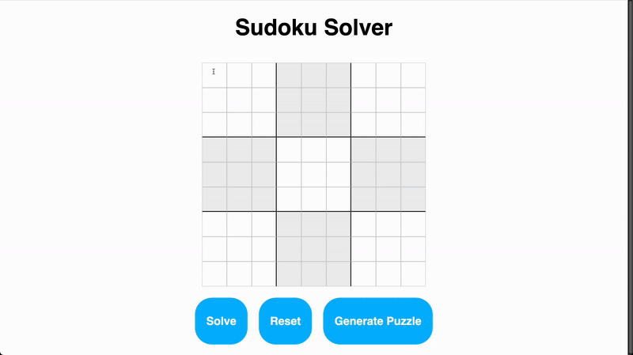

# Sudoku Solver  
A responsive web-based Sudoku solver and puzzle generator with visual backtracking animation that demonstrates how the algorithm works step by step.

## Demo  

## Usage  
1. Visit the [GitHub Pages link](https://justinr25.github.io/sudoku-solver/) or open `index.html` in your browser.  
2. Input your own puzzle or click **Generate Puzzle** for a random board.  
3. Click **Solve** to watch the backtracking algorithm animate step-by-step.  
4. Use **Reset** to clear the board and start over.  
